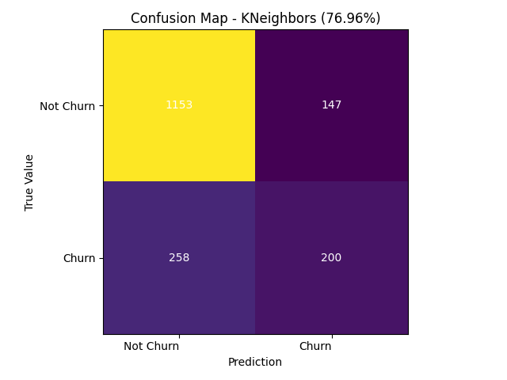
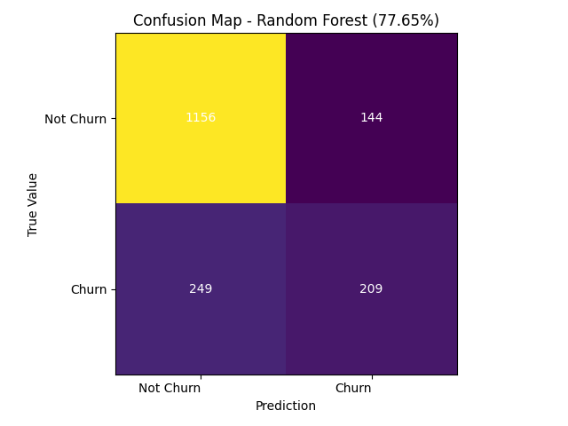

# Relatório

## Preparação dos dados
Foi desconsiderado as colunas `CustomerID`, `Contract`, `PaperlessBilling` e `PaymentMethod`.

### Mapeamento de coluna
| Coluna | Map |
| ---- | --- |
| gender | `{ 'Male': 0, 'Female': 1 }` |
| Partner | `{ 'No': 0, 'Yes': 1 }` |
| Dependents | `{ 'No': 0, 'Yes': 1 }` |
| PhoneService | `{ 'No': 0, 'Yes': 1 }` |
| MultipleLines | `{ 'No phone service': 0, 'No': 0, 'Yes': 1 }` |
| OnlineSecurity | `{ 'No internet service': 0, 'No': 0, 'Yes': 1 }` |
| OnlineBackup | `{ 'No internet service': 0, 'No': 0, 'Yes': 1 }` |
| DeviceProtection | `{ 'No internet service': 0, 'No': 0, 'Yes': 1 }` |
| TechSupport | `{ 'No internet service': 0, 'No': 0, 'Yes': 1 }` |
| StreamingTV | `{ 'No internet service': 0, 'No': 0, 'Yes': 1 }` |
| StreamingMovies | `{ 'No internet service': 0, 'No': 0, 'Yes': 1 }` |
| Churn | `{ 'No': 0, 'Yes': 1 }` |

### One-hot
A coluna InternetService foi transformada nas colunas InternetService_DSL e InternetService_FiberOptic.

## Treinamento
Foram testado os modelos Logistic Regression, K-Nearest Neighbors, Random Forst, Hist Gradient Boosting.

### Resultados

A seguir, heat maps com a relação entre as pessoas que cancelaram e mantiveram seus serviços (churn) entre os dados reais e os dados previstos pelo modelo treinado.

